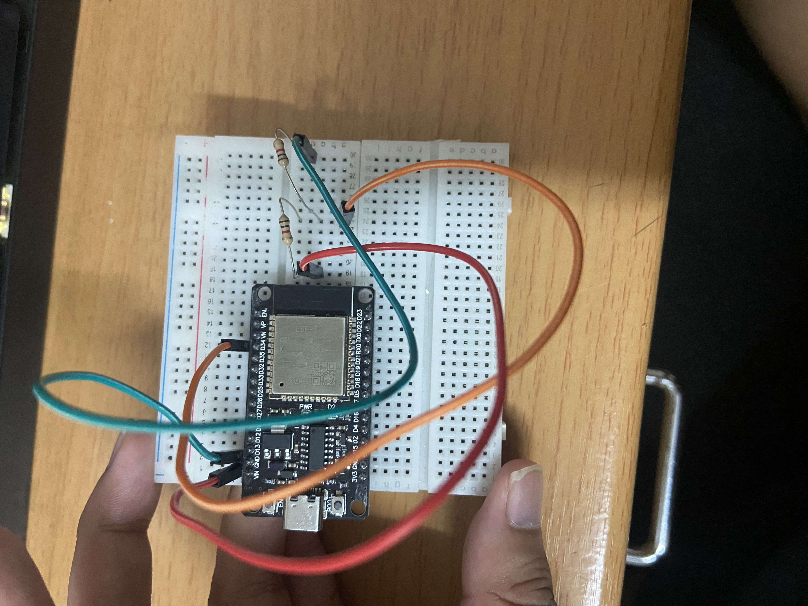

# ESP32 Health Check

Quick sanity test for an ESP32 board. Prints chip info, scans Wi-Fi, and measures VIN through a voltage divider on ADC1.

Built with ESP-IDF v6.0.2 (needs v5.1+).

## Wiring

Never connect VIN directly to a GPIO. ESP32 ADC pins accept up to ~3.1 V.

```
VIN ──[R1 10k]──┬──[R2 10k]── GND
                │
             GPIO34
```

| From | To |
|---|---|
| VIN | R1 |
| R1 / R2 junction | GPIO34 |
| R2 | GND |

<!-- Replace with your photo -->


## Config

Edit the top of `main/hello_world_main.c`:

```c
#define VIN_SENSE_GPIO   34        // must be an ADC1 pin
#define R_TOP_OHM        10000.0f  // R1
#define R_BOTTOM_OHM     10000.0f  // R2
```

## Build

```sh
idf.py build flash monitor
```

## Expected output

```
Target       : esp32
Flash size   : 2 MB
Reset reason : Power-on
HEALTH: Wi-Fi OK: found 3 AP
Pin: 2418 mV  ->  VIN: 4.84 V   [normal]
```

| Check | Healthy if |
|---|---|
| Boot | Chip info prints, reset reason is not `PANIC` or `BROWNOUT` |
| Wi-Fi | At least one AP found |
| VIN | 4.6–5.25 V on USB power (the board's diode drops ~0.2 V) |

## Notes

- Readings are accurate to about ±5% (ADC and resistor tolerance).
- If the log says flash is larger than the image header, set the real size in `idf.py menuconfig` → Serial flasher config → Flash size.